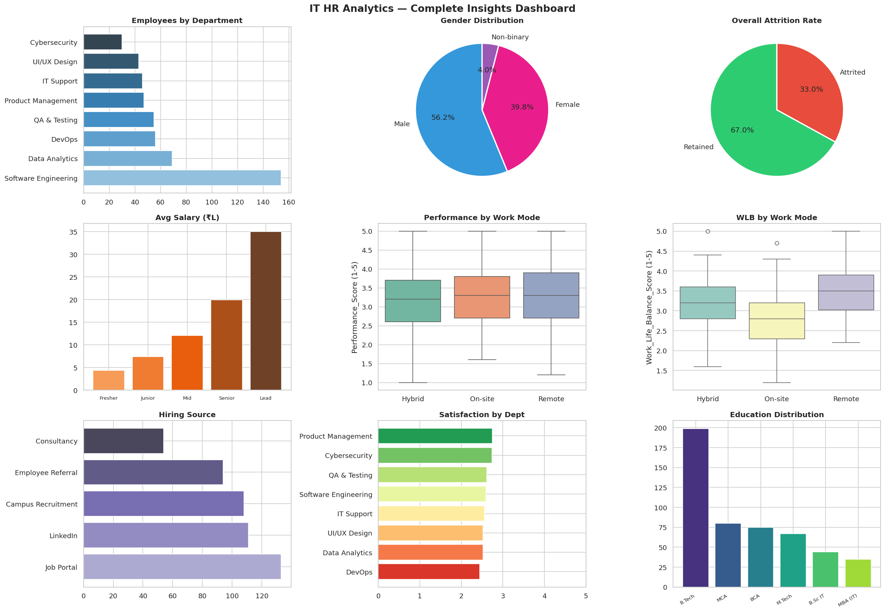
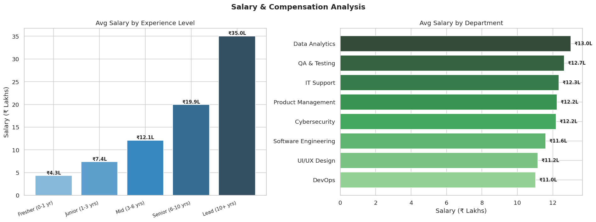
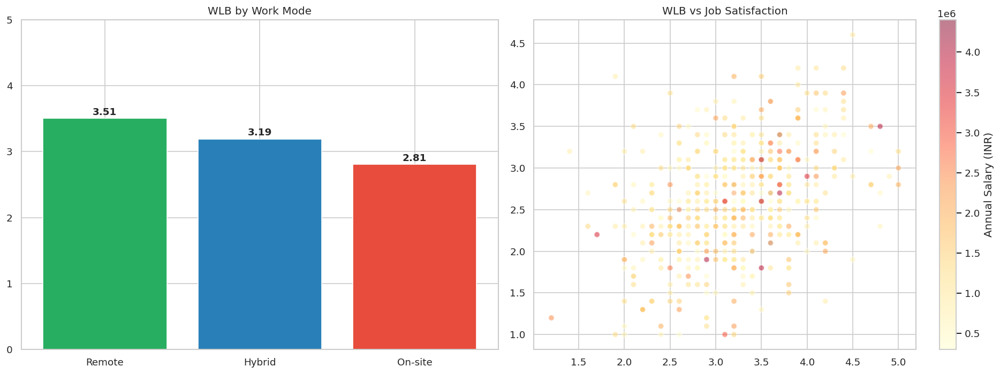
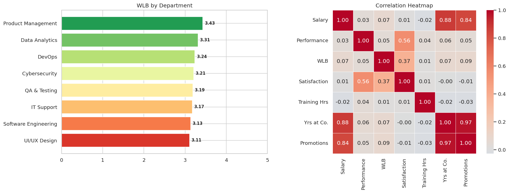

# 🏢 IT HR Analytics Project

> Analyzing Employee Attrition, Salary, Performance & Work-Life Balance in an IT Company

    

---

## 📌 Project Overview

This project performs an end-to-end HR data analysis on a custom dataset of **500 IT company employees**. The goal is to uncover insights about employee attrition, compensation trends, performance patterns, and work-life balance across departments and experience levels.

This project was built as part of a Data Analytics portfolio to demonstrate real-world analytical thinking and Python data skills.

---

## 🎯 Objectives

- Understand the structure and quality of HR data through cleaning and EDA
- Analyze salary trends across departments, experience levels, and gender
- Identify performance patterns and the impact of training hours
- Explore work-life balance across different work modes (Remote, Hybrid, On-site)
- Visualize key HR insights through professional charts and a summary dashboard
- Generate actionable business recommendations from data

---

## 📁 Project Structure

```
HR_Analytics_Project/
│
├── IT_HR_Analytics.ipynb          # Main Jupyter Notebook
├── IT_HR_Analytics_Dataset.xlsx   # Custom HR dataset (500 employees)
├── README.md                      # Project documentation
│
├── 01_distributions.png           # Salary, performance & satisfaction distributions
├── 02_salary_analysis.png         # Salary by experience & department
├── 03_salary_deep_dive.png        # Salary by gender & appraisal rating
├── 04_performance_analysis.png    # Performance by dept & vs training hours
├── 05_performance_breakdown.png   # Performance by experience & appraisal pie
├── 06_wlb_analysis.png            # WLB by work mode & vs satisfaction scatter
├── 07_wlb_heatmap.png             # Correlation heatmap of key HR metrics
└── 08_final_dashboard.png         # Complete 9-chart summary dashboard
```

---

## 📊 Dataset Description

The dataset was **custom built** by combining insights from multiple public HR datasets and generating realistic IT-sector employee data.

| Column | Description |
|--------|-------------|
| Employee_ID | Unique employee identifier |
| Gender | Male / Female / Non-binary |
| Age | Employee age |
| Education | Highest qualification (B.Tech, MCA, etc.) |
| City | Work location city in India |
| Department | IT department (Engineering, DevOps, QA, etc.) |
| Job_Role | Specific role within department |
| Experience_Level | Fresher / Junior / Mid / Senior / Lead |
| Years_At_Company | Tenure at the company |
| Work_Mode | Remote / Hybrid / On-site |
| Hiring_Source | How the employee was recruited |
| Annual_Salary_INR | Annual CTC in Indian Rupees |
| Last_Appraisal_Rating | Performance appraisal outcome |
| Number_of_Promotions | Total promotions received |
| Performance_Score (1-5) | Current performance rating |
| Training_Hours_Per_Year | Annual training hours completed |
| Work_Life_Balance_Score (1-5) | Self-reported WLB rating |
| Job_Satisfaction_Score (1-5) | Overall job satisfaction rating |
| Attrition | Whether employee left (Yes/No) |

---

## 🔍 Key Insights

- **Attrition Rate:** ~33% — highest among Fresher employees and low-satisfaction departments
- **Salary:** Cybersecurity and Product Management roles command the highest average salaries
- **Performance:** Employees with more training hours show a positive correlation with performance scores
- **Work-Life Balance:** Remote workers consistently report higher WLB and satisfaction scores
- **Hiring:** LinkedIn and Job Portals are the top hiring sources for IT talent

---

## 📈 Notebook Sections

1. **Import Libraries** — Setting up the analysis environment
2. **Load Dataset** — Reading from Excel into Pandas DataFrame
3. **Data Cleaning & EDA** — Missing values, duplicates, distributions
4. **Salary & Compensation Analysis** — Trends by experience, department, gender
5. **Performance & Productivity Analysis** — Scores by role, training impact
6. **Work-Life Balance Analysis** — WLB by work mode, dept, and correlation heatmap
7. **Final Dashboard** — 9-chart overview in one figure
8. **Key Insights & Recommendations** — Auto-generated business recommendations

---

## 🛠️ Tech Stack

| Tool | Purpose |
|------|---------|
| Python 3.10+ | Core programming language |
| Pandas | Data manipulation and analysis |
| NumPy | Numerical computations |
| Matplotlib | Base visualizations |
| Seaborn | Statistical charts and styling |
| OpenPyXL | Excel file reading |
| Jupyter Notebook | Interactive development environment |

---

## 🚀 How to Run

**Step 1 — Clone or download the project**
```bash
git clone https://github.com/yourusername/IT-HR-Analytics.git
cd IT-HR-Analytics
```

**Step 2 — Install dependencies**
```bash
pip install jupyter pandas numpy matplotlib seaborn openpyxl
```

**Step 3 — Launch Jupyter Notebook**
```bash
jupyter notebook IT_HR_Analytics.ipynb
```

**Step 4 — Run all cells**

Go to `Kernel → Restart & Run All` to execute the full analysis.

> ⚠️ Make sure `IT_HR_Analytics_Dataset.xlsx` is in the same folder as the notebook.

---

## 📷 Sample Visualizations

### Final Dashboard


### Salary Analysis


### Work-Life Balance


### Correlation Heatmap


---

## 💡 Recommendations

Based on the analysis, here are key HR recommendations:

1. **Retention Programs** — Focus on departments with highest attrition; introduce mentorship for freshers
2. **Training Investment** — Increase training hours as they positively impact performance scores
3. **Remote/Hybrid Policy** — Promote flexible work models to improve WLB and satisfaction
4. **Salary Review** — Benchmark compensation for lower-paying departments to reduce attrition risk
5. **Hiring Strategy** — Strengthen LinkedIn and employee referral pipelines as top-performing channels

---

## 👩‍💻 Author

**Sia Sharma**
- 🎓 B.Tech in Information Technology — MIT ADT University
- 💼 Aspiring Data Analyst | Python | SQL | Tableau | Power BI
- 🔗 [LinkedIn](https://www.linkedin.com/in/mausamkumari-thakur-81471b291/)
- 💻 [GitHub](https://github.com/Mausamkumarithakur)

---
